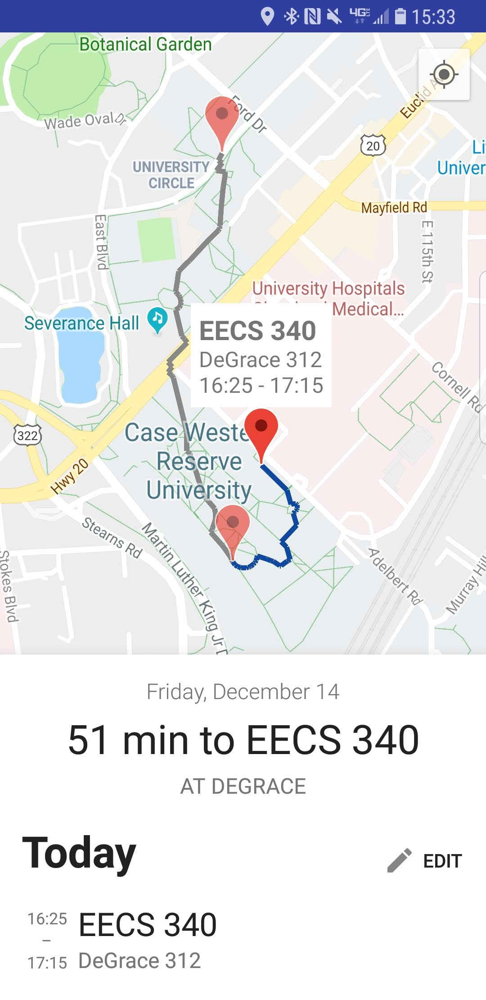
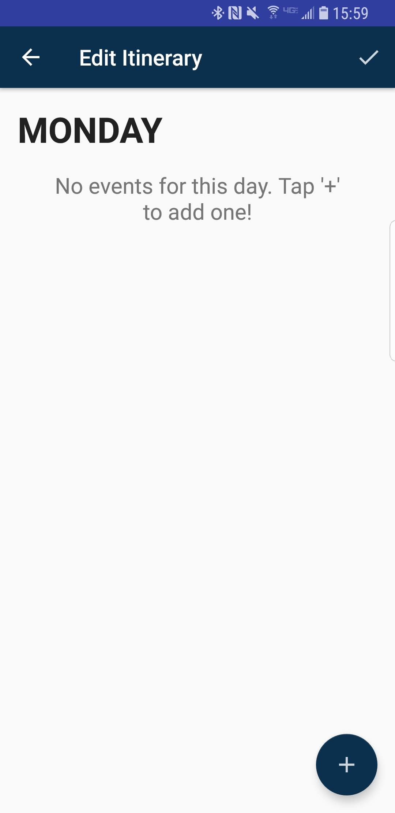
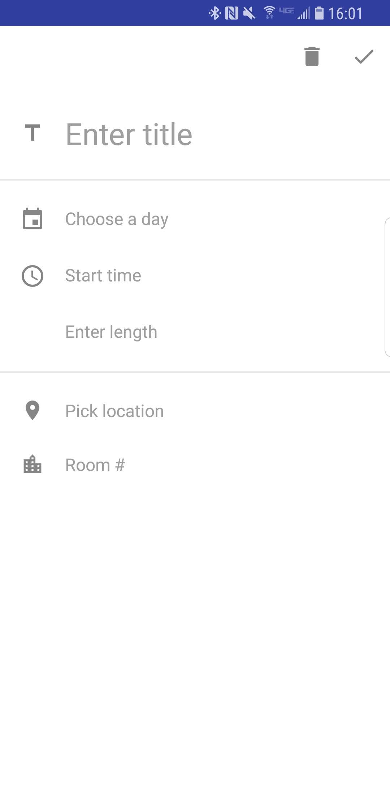

# CWRUMapper

A mapping application for Android targeted at students attending Case Western Reserve University to get where they need to go each week. Students enter their schedule for each day of the week (classes, club meetings), including weekends, and the app maps their route each day.

## Requirements

You will need:

- An Android device (8.0+)
- A Google account (preferably under the @case.edu domain)
- A schedule of classes/meetings at CWRU

## How to Install + Use

- Download the APK from the [Releases](http://github.com/i077/CWRUMapper/releases) tab to your Android phone
- Install (sideload) the APK. You may need to grant permission to install apps from outside sources to do this. Your phone will notify you if this is necessary.
- Open CWRUMapper, and sign in with a Google account

### Setting up a weekly schedule

Once sign-in succeeds, you'll be taken to the main app screen. Tap "Edit" on the bottom sheet as seen in the screenshot above. You'll be taken to the edit screen, which should look like this:

Tap the '+' button to add an event:

This is the event editing screen. Add a title and the day of the week the event takes place (you'll have to add events for each day for now). Enter the starting time and length, then enter the first few characters of the building name and tap the suggestion for the correct building.

>  Note: You must use the autocomplete suggestions, or the event may not save!

Once you're done, optionally enter a room number and save by tapping the check icon at the top right.

Do this for each event on each day of the week. Once you're done, at the edit itinerary screen, hit save! (If you just hit 'back', your changes will be lost.) The app will take you back to the mapping screen with your newly updated route for the day.